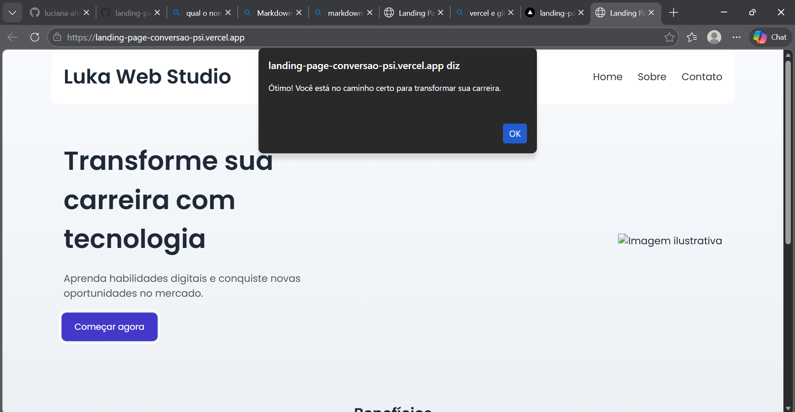

# 🚀 Landing Page de Alta Conversão

Landing page moderna e responsiva desenvolvida com HTML, CSS e JavaScript, com foco em experiência do usuário (UX) e design orientado à conversão.

---

## 🎯 Objetivo

Criar uma interface profissional inspirada em páginas reais de produtos digitais, aplicando boas práticas de:

- HTML semântico  
- Responsividade (Mobile First)  
- Organização de código  
- Interatividade com JavaScript  

---

## 🛠️ Tecnologias Utilizadas

- HTML5  
- CSS3 (Flexbox + Grid)  
- JavaScript (DOM)  
- Variáveis CSS (`:root`)  
- Google Fonts  

---

## 📱 Funcionalidades

✔️ Layout responsivo para mobile e desktop  
✔️ Seção Hero com chamada principal  
✔️ Cards de benefícios com efeito hover  
✔️ Depoimentos simulados  
✔️ Botão interativo com JavaScript  
✔️ Estrutura organizada em arquivos separados  

---

## 🌐 Deploy

🔗 Acesse o projeto online:  
👉 https://landing-page-conversao-psi.vercel.app/

---

## 📸 Prévia



---


## 📁 Estrutura do Projeto
📦 landing-page-conversao
┣ 📜 index.html
┣ 📜 styles.css
┣ 📜 script.js
┣ 📂 assets
┗ 📜 README.md

---

## 🚀 Como Executar o Projeto

```bash
# Clone o repositório
git clone https://github.com/luciana-alves-barbosa/landing-page-conversao.git

# Acesse a pasta
cd landing-page-conversao

# Abra o arquivo
index.html

```

## 💡 Aprendizados

`-` Durante o desenvolvimento deste projeto, foram aplicados conceitos como:

* Organização de arquivos (HTML, CSS e JS separados)
* Uso de variáveis CSS para padronização visual
* Estruturação de layout com Flexbox
* Responsividade para diferentes dispositivos
* Manipulação básica do DOM com JavaScript

---

## 👩‍💻 Autora

Luciana Alves Barbosa

🔗 LinkedIn: https://www.linkedin.com/in/luciana-alves-barbosa/
